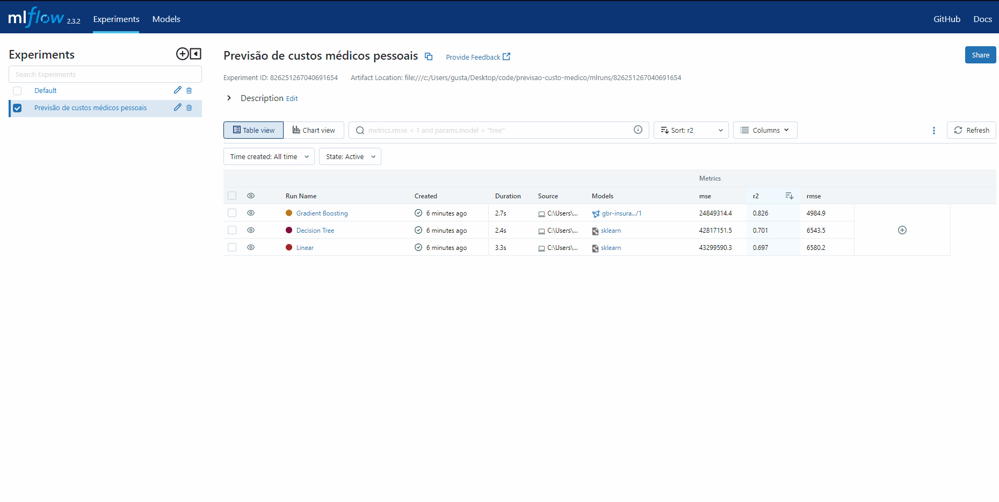

# Previsão de custo pessoal médico

**Objetivo:** Utilizar de uma base de custos de pessoais de seguro de saúde, para realizar uma regressão que preveja o custo médico da pessoa. É uma base de dados de estudos, com o foco de testar o Ml Flow como ferramenta de tracking de experimentos e deploy de modelos.

**Resultados:** Experimentos realizados e trackeados, todos salvos em repositório local permitindo reprodutibilidade, além de endpoint Flask que se utiliza do melhor modelo encontrado em produção. Toda a gerência do ciclo de ML Ops feito pelo ML Flow e sua UI.

### Arquitetura do projeto

Todo o treinamento dos modelos, o registro e armazenamento do modelo, a escolha do melhor e seu deploy são realizados na interface do ML Flow.

A grande vantagem da ferramenta, até em projetos mais simples, é que o modelo pode ser facilmente carregado e disponibilizado para consumo via API, onde para o usuário final o Endpoint seria mesmo apenas alterando para qual modelo ele está carregando.

